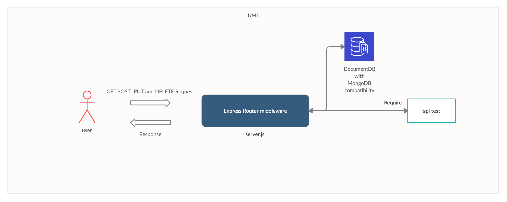

# Dynamic API Server

**Author**: Abdallah Safi

**Version**: 1.0.0 

## Overview
An Express/Node.js based server designed to be a “model agnostic” REST API server, which can perform CRUD operations on any data model

## Getting Started

These instructions will get you a copy of the project up and running on your local machine for development and testing purposes. See deployment for notes on how to deploy the project on a live system.

## Prerequisites

- Operating system: Mac OS, Windows, Linux
- Git
  Follow the instruction in the links below to install git in your machine
  - [Windows](https://git-scm.com/download/win)
  - [Mac OS](https://git-scm.com/download/mac)
  - [Linux](https://git-scm.com/download/linux)
- [Codeing Editor](https://www.wpbeginner.com/showcase/12-best-code-editors-for-mac-and-windows-for-editing-wordpress-files/)

## Installation

1. open your terminal

2. Clone the repo

`git clone https://github.com/abdallahsafi-401-advanced-javascript/api-server.git`

## Usage

- [swagger](https://app.swaggerhub.com/apis/AbdallahSafi/my-app-server)

## Architecture

This application was build with express Node.js framwork and it includes:
- jest: test package
- @code-fellows/supergoose: to test the HTTP and mongo database
- morgan: to log the method and the timestamp on the terminal
- cors: to set rules for cross origins

# UML diagram

## Change Log
16-09-2020 3:00pm 

